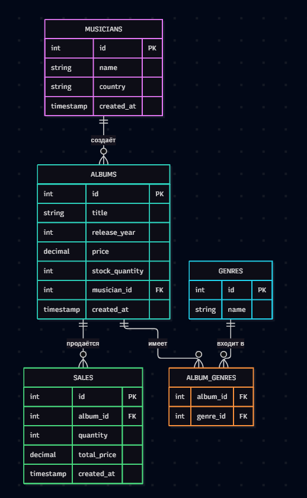

# 🎵 Музыкальный магазин (music-store-devops241_351)

Учебный проект по дисциплине «Методология и практики DevOps».

## 📖 Описание

Веб-приложение для учета музыкальных дисков, управления каталогом исполнителей,
оформления продаж и отслеживания остатков на складе.

## 👥 Команда

| Участник | Роль | Зона ответственности |
|----------|------|----------------------|
| Участник 1 | Backend/DB | PostgreSQL, модели SQLAlchemy, Alembic, Docker |
| Участник 2 | API/Logic | FastAPI, эндпоинты, JWT-авторизация, бизнес-логика |
| Участник 3 | Frontend/Docs/Git | Шаблоны Jinja2, документация, Git-процесс |

## 🛠️ Стек технологий

- Python 3.11+
- FastAPI — HTTP API и Swagger-документация
- PostgreSQL 15 — реляционная БД
- SQLAlchemy + Alembic — ORM и миграции
- Jinja2 — HTML-шаблоны
- Docker + Docker Compose — инфраструктура
- JWT — авторизация

## 📂 Структура проекта

```text
music-store-devops241_351/
├── app/                        # Основной код приложения
│   ├── templates/              # HTML-шаблоны (Jinja2)
│   │   ├── base.html
│   │   ├── catalog.html
│   │   ├── login.html
│   │   └── admin.html
│   ├── static/                 # CSS, JS, изображения
│   │   └── style.css
│   ├── auth.py                 # JWT-авторизация
│   ├── albums.py               # API альбомов
│   ├── musicians.py            # API музыкантов
│   ├── sales.py                # API продаж
│   ├── schemas.py              # Pydantic-схемы
│   ├── database.py             # Подключение к БД
│   └── main.py                 # Точка входа, healthcheck
├── alembic/                    # Миграции БД
│   └── versions/
├── db/
│   └── init.sql                # Начальные данные
├── docs/
│   ├── TZ.md                   # Техническое задание
│   └── schema.png              # ER-диаграмма
├── .env.example                # Пример переменных окружения
├── .gitignore
├── alembic.ini
├── docker-compose.yml          # Конфигурация PostgreSQL
├── models.py                   # Модели SQLAlchemy
├── CONTRIBUTING.md             # Правила внесения изменений
├── requirements.txt            # Зависимости Python
└── README.md
```

## 🚀 Запуск проекта

### Предварительные требования

- Python 3.11+
- Docker Desktop
- Git

### Пошаговая инструкция

**1. Клонировать репозиторий:**

```bash
git clone https://github.com/Sandr192/music-store-devops241_351.git
cd music-store-devops241_351
```

**2. Создать `.env` из шаблона:**

```bash
cp .env.example .env
```

При необходимости отредактировать значения в `.env`.

**3. Запустить базу данных PostgreSQL:**

```bash
docker-compose up -d db
```

**4. Установить Python-зависимости:**

```bash
python -m venv venv
source venv/Scripts/activate   # Windows (MINGW64)
# или: source venv/bin/activate  # Linux/macOS
pip install -r requirements.txt
```

**5. Применить миграции БД:**

```bash
alembic upgrade head
```

**6. Запустить приложение:**

```bash
uvicorn app.main:app --reload
```

**7. Открыть в браузере:**

- Приложение: http://localhost:8000
- Swagger-документация: http://localhost:8000/docs
- Healthcheck: http://localhost:8000/health

## 📊 Схема данных

### Сущности

| Таблица | Описание |
|---------|----------|
| `musicians` | Музыканты (id, name, country) |
| `genres` | Жанры (id, name) |
| `albums` | Альбомы (id, title, year, price, stock_quantity, musician_id) |
| `album_genres` | Связь многие-ко-многим: альбомы ↔ жанры |
| `sales` | Продажи (id, album_id, quantity, total_price, created_at) |

### Связи

- `albums.musician_id` → `musicians.id` (многие-к-одному)
- `album_genres` — многие-ко-многим между `albums` и `genres`
- `sales.album_id` → `albums.id` (многие-к-одному)

### Бизнес-правила

- Цена и остаток альбома не могут быть отрицательными.
- Количество продажи > 0, итоговая цена >= 0.
- Нельзя продать диск, если его остаток равен нулю.

### ER-диаграмма



## 🔗 Полезные ссылки

- **Репозиторий:** https://github.com/Sandr192/music-store-devops241_351
- **Swagger API:** http://localhost:8000/docs
- **Healthcheck:** http://localhost:8000/health
- **Техническое задание:**


[docs/TZ.md](docs/TZ.md)
- **Правила внесения изменений:** [CONTRIBUTING.md](CONTRIBUTING.md)

## 📋 Статус проекта

- [x] Репозиторий и Git-процесс настроены
- [x] Техническое задание написано
- [x] Модели SQLAlchemy созданы
- [x] Миграции Alembic настроены
- [x] API-эндпоинты реализованы
- [x] JWT-авторизация работает
- [x] Healthcheck реализован
- [x] Docker Compose настроен
- [x] Тег `v0.1.0` создан
- [ ] ER-диаграмма (если `docs/schema.png` отсутствует — добавить)

## 📜 Лицензия

Учебный проект. Свободное использование в образовательных целях.V